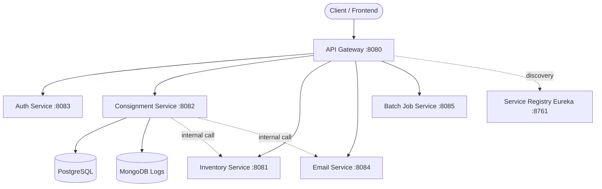
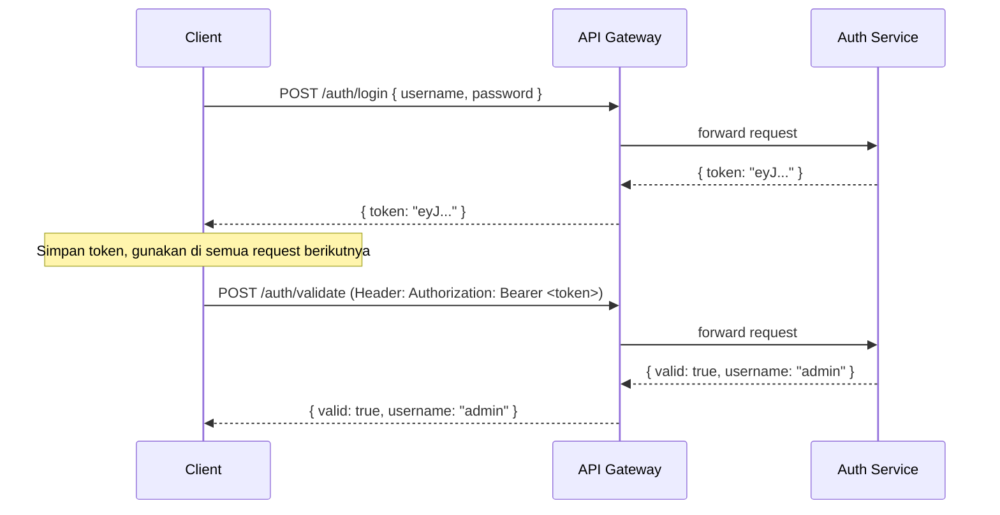
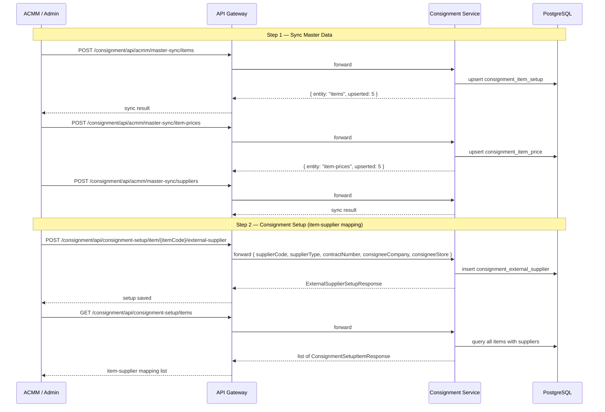
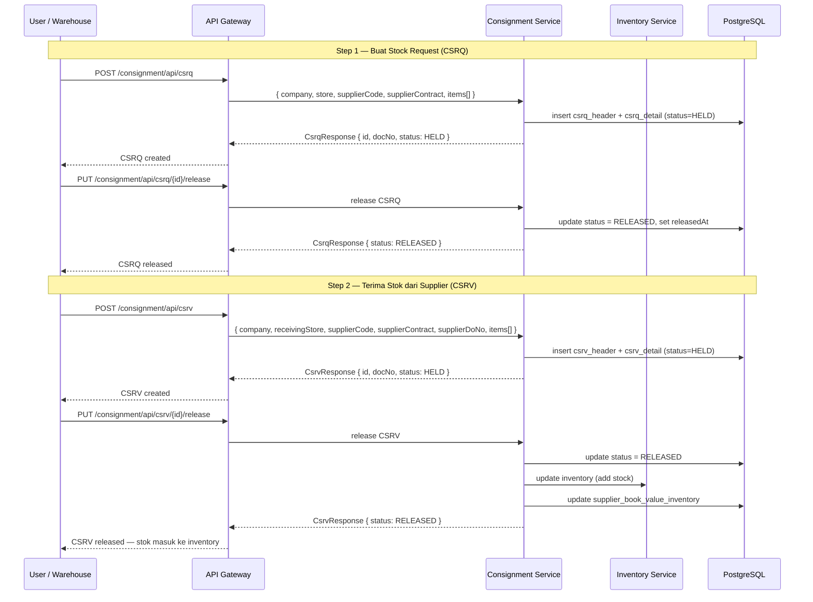
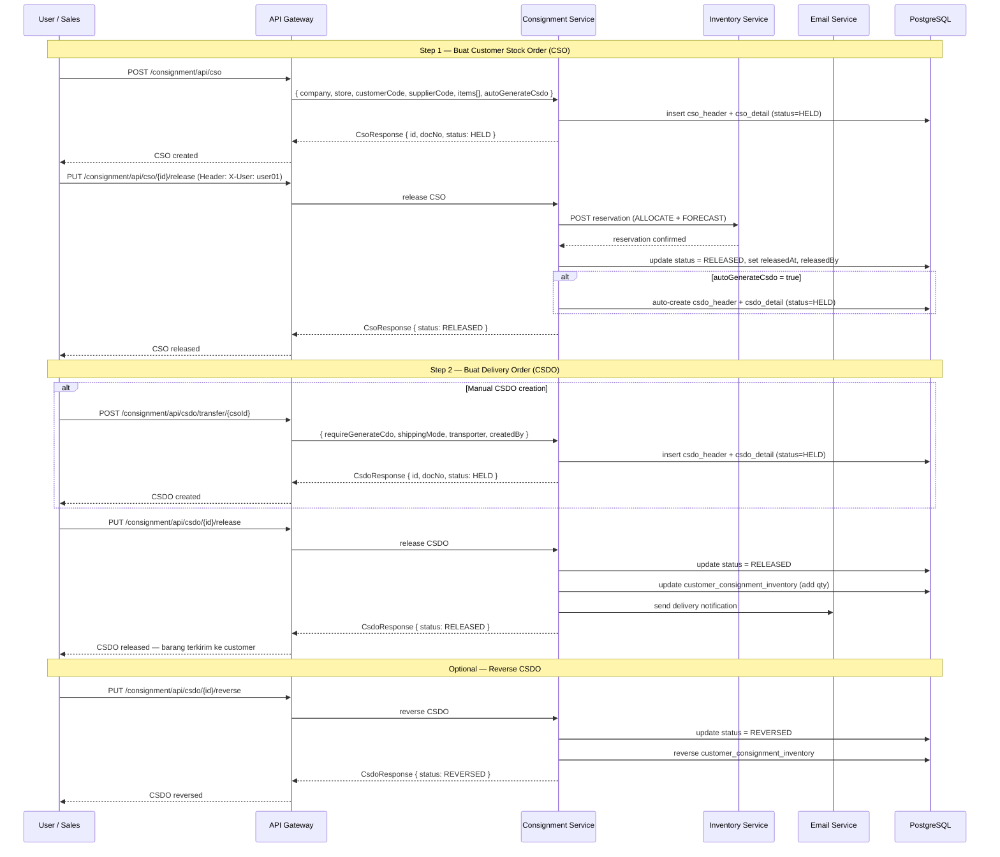
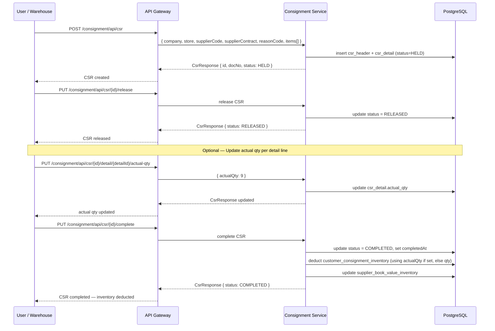
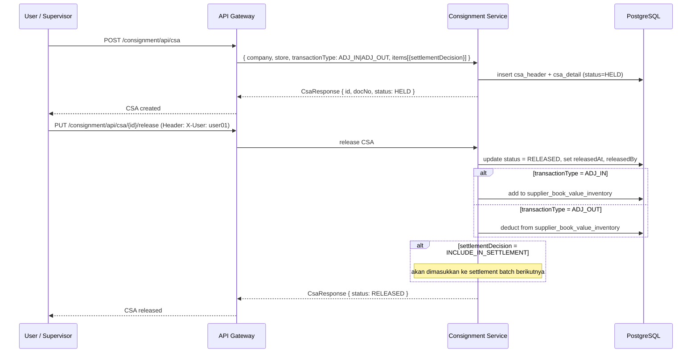
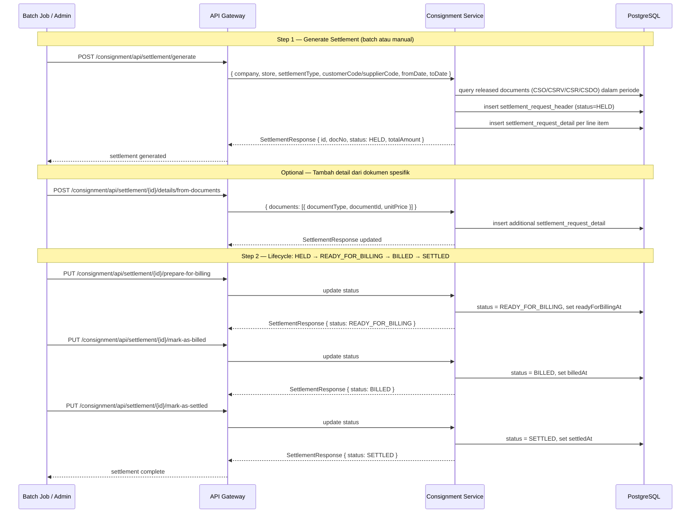
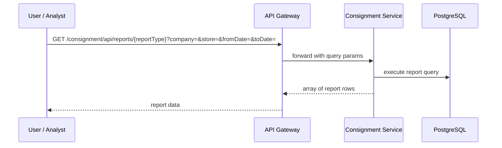
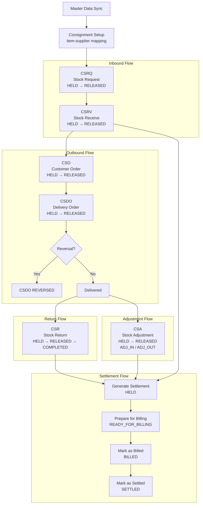

# CMS API Flow Documentation

Platform microservices Spring Boot — semua request masuk melalui API Gateway (port 8080).

---

## Arsitektur Platform



---

## Status Lifecycles

| Dokumen | Status Flow |
|---------|-------------|
| CSRQ | `HELD` → `RELEASED` \| `CANCELLED` |
| CSRV | `HELD` → `RELEASED` |
| CSO | `HELD` → `RELEASED` \| `ERROR` |
| CSDO | `HELD` → `RELEASED` → `REVERSED` |
| CSR | `HELD` → `RELEASED` → `COMPLETED` |
| CSA | `HELD` → `RELEASED` |
| Settlement | `HELD` → `READY_FOR_BILLING` → `BILLED` → `SETTLED` |

---

## Flow 0: Authentication

Semua request (kecuali `/auth/*`) memerlukan JWT token di header `Authorization: Bearer <token>`.



**Endpoints:**
- `POST /auth/login` — dapat token
- `POST /auth/register` — daftarkan user baru
- `POST /auth/validate` — validasi token (digunakan internal oleh gateway)

---

## Flow 1: Setup — Master Sync + Consignment Setup

Sebelum transaksi bisa dilakukan, master data harus disync dan item-supplier mapping harus dikonfigurasi.



**Entities yang bisa disync:** `items`, `item-prices`, `suppliers`, `contracts`, `companies`, `stores`, `customers`, `reasons`

---

## Flow 2: Inbound — CSRQ → CSRV

Alur permintaan stok dari supplier dan penerimaan fisik barang.



**Auto-create CSRV dari ACMM:**
```
POST /consignment/api/acmm/csrv/auto-create
```
Digunakan oleh integrasi ACMM/SQS untuk membuat CSRV secara otomatis.

---

## Flow 3: Outbound — CSO → CSDO

Alur order stok ke customer dan pengiriman barang.



**Auto-create CSO dari ACMM/POS:**
```
POST /consignment/api/acmm/cso/auto-create
```

---

## Flow 4: Return — CSR

Alur pengembalian stok dari customer ke supplier.



---

## Flow 5: Adjustment — CSA

Alur penyesuaian stok (ADJ IN / ADJ OUT) dengan keputusan settlement.



**`settlementDecision` values:**
- `INCLUDE_IN_SETTLEMENT` — masuk ke perhitungan settlement
- `EXCLUDE_FROM_SETTLEMENT` — tidak masuk settlement

---

## Flow 6: Settlement

Alur penagihan dan penyelesaian pembayaran consignment.



**Trigger batch settlement via Batch Job Service:**
```
POST /batch/settlement/trigger?businessDate=2024-01-31
```

---

## Flow 7: Reports (R01–R12)

Semua report endpoint menggunakan `GET` dengan query params filter.



| Report | Endpoint | Deskripsi |
|--------|----------|-----------|
| R01 | `GET /consignment/api/reports/csrq` | CSRQ transactions by period |
| R02 | `GET /consignment/api/reports/csrv` | CSRV transactions by period |
| R03 | `GET /consignment/api/reports/cso` | CSO transactions by period |
| R04 | `GET /consignment/api/reports/csdo` | CSDO transactions by period |
| R05 | `GET /consignment/api/reports/csr` | CSR transactions by period |
| R06 | `GET /consignment/api/reports/csa` | CSA transactions by period |
| R07 | `GET /consignment/api/reports/settlement-summary` | Settlement summary |
| R08 | `GET /consignment/api/reports/settlement-detail/{id}` | Settlement detail lines |
| R09 | `GET /consignment/api/reports/supplier-book-value` | Supplier BV inventory |
| R10 | `GET /consignment/api/reports/customer-inventory` | Customer consignment on-hand |
| R11 | `GET /consignment/api/reports/reservations` | Open reservations |
| R12 | `GET /consignment/api/reports/consignment-setup` | Item-supplier mapping |

**Trigger report pre-computation:**
```
POST /batch/report/trigger?reportDate=2024-01-30
```

---

## Flow 8: End-to-End Business Flow

Gambaran lengkap alur bisnis dari setup hingga settlement.



---

## Headers Penting

| Header | Endpoint | Keterangan |
|--------|----------|------------|
| `Authorization: Bearer <token>` | Semua endpoint (kecuali `/auth/*`) | JWT token dari login |
| `X-User: <username>` | `PUT /cso/{id}/release`, `PUT /csa/{id}/release` | Username yang melakukan release |
| `Content-Type: application/json` | Semua POST/PUT | Wajib untuk request body |

---

## Error Responses

Semua error mengikuti format:

```json
{
  "error": "string",
  "message": "string",
  "timestamp": "2024-01-15T08:00:00Z"
}
```

| HTTP Status | Kondisi |
|-------------|---------|
| 400 | Validation error, status transition tidak valid |
| 401 | Token tidak ada atau expired |
| 404 | Resource tidak ditemukan |
| 500 | Internal server error |
